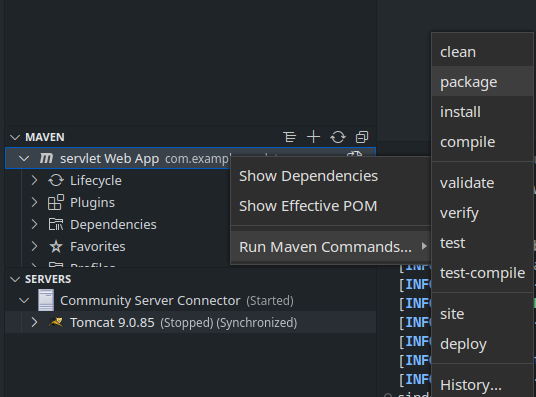
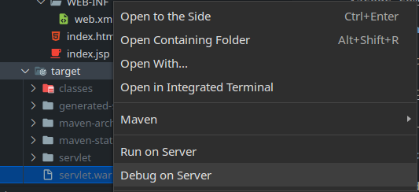

# JEE Projects

## Getting started

### Pre-requisites

- Install [Tomcat](https://tomcat.apache.org/download-90.cgi) & extract it
- Configure Tomcat default GUI user.
- Add Tomcat using [Community Server ConnectorsPreview](https://marketplace.visualstudio.com/items?itemName=redhat.vscode-community-server-connector)

### JEE in VSCode

- Create the `.war` file using `mvn package` or through the editor shortcuts

  

- Right click on the `.war` file, then click "Debug on Server" or "Run on Sever"

  

- Publish the changes to the server

  

### Troubleshooting

- In case a change was made to the `Java` files, a re-build and re-deployment is necessary.
- If an error is shown that an endpoint is duplicated, a clean and a re-deployment might be necessary.

## Resources

- [Run and Debug Java Web Application in Tomcat using VS Code](https://youtu.be/RiPot1ne8rI)
