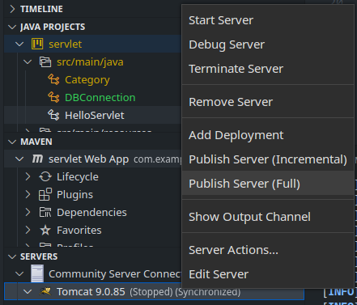

# JEE Projects

## Getting started

The projects specified in the [projects](./projects/README.md) directory can be opened in any Java-enabled IDE.

### Pre-requisites

- Install [Tomcat](https://tomcat.apache.org/download-90.cgi) & extract it
- Configure Tomcat default GUI user. I also update the default port to `8888`
- Add Tomcat using [Community Server ConnectorsPreview](https://marketplace.visualstudio.com/items?itemName=redhat.vscode-community-server-connector)

### JEE in VSCode

- Create the `.war` file using `mvn package` or through the editor shortcuts

  

- Right click on the `.war` file, then click "Debug on Server" or "Run on Sever"

  

- Publish the changes to the server

  

### Troubleshooting

- In case a change was made to the `Java` files, a re-build and re-deployment is necessary.
- If an error is shown that an endpoint is duplicated, a clean and a re-deployment might be necessary.
- If you can't reach the application, then you should prefix the path you specify with the `/project-name`. E.g. <http://localhost:8888/servlet/hello> to reach the [Hello Servlet](./projects/servlet/src/main/java/HelloServlet.java)

## Roadmap

- [ ] Finish TP2 assignment
- [x] Make the `login.jsp` page use the new c jdlt

## Resources

- [Run and Debug Java Web Application in Tomcat using VS Code](https://youtu.be/RiPot1ne8rI)
